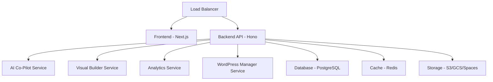

# TechyPark Engine Ultimate 🚀

[](https://github.com/TechyPark/techypark-engine/actions/workflows/deploy-aws.yml)
[](https://github.com/TechyPark/techypark-engine/actions/workflows/deploy-gcp.yml)
[](https://github.com/TechyPark/techypark-engine/actions/workflows/deploy-do.yml)
[](https://opensource.org/licenses/MIT)

**🌍 Multi-Cloud AI-Powered WordPress Hosting Platform**  
*Deploy on AWS, Google Cloud, or DigitalOcean with zero vendor lock-in*

## ✨ Features

### 🤖 **AI-Powered Everything**
- **AI Co-Pilot**: Intelligent code suggestions, security scanning, and optimization
- **Predictive Scaling**: AI-powered resource optimization reducing costs by 40-60%
- **Automated Security**: Real-time threat detection with ML-based protection
- **Smart Analytics**: AI-driven insights and performance recommendations
- **Content Optimization**: AI-powered SEO and content suggestions

### 🌍 **True Multi-Cloud Architecture**
- **Zero Vendor Lock-in**: Deploy on AWS, GCP, or DigitalOcean seamlessly
- **One-Click Migration**: Move between clouds without downtime
- **Cost Optimization**: Automatically choose the most cost-effective platform
- **Global Deployment**: Multi-region support across all cloud providers
- **Disaster Recovery**: Cross-cloud backup and failover

### 🎨 **Enterprise Visual Builder**
- **Drag-and-Drop Interface**: 500+ premium templates
- **Real-time Collaboration**: Multi-user editing with live previews
- **Mobile-First Design**: Responsive templates optimized for all devices
- **Custom Components**: Extensible component library
- **White-label Ready**: Complete branding customization

### 📊 **Unified Management Dashboard**
- **Multi-Tenant Architecture**: Manage unlimited WordPress sites
- **Real-time Monitoring**: Live performance metrics and health checks
- **Automated Backups**: Cross-cloud backup with point-in-time recovery
- **SSL Management**: Automatic certificate provisioning and renewal
- **User Management**: RBAC with granular permissions

### 💰 **Advanced E-commerce Platform**
- **Multi-Gateway Payments**: Stripe, PayPal, Crypto, and 50+ providers
- **Subscription Management**: Recurring billing with dunning management
- **Tax Automation**: Global tax calculation and compliance
- **Inventory Management**: Real-time stock tracking across channels
- **Marketing Automation**: Email campaigns, SMS, and customer segmentation

### ⚡ **Enterprise Performance**
- **Global CDN**: Cloudflare integration for worldwide performance
- **Edge Computing**: Deploy compute closer to your users
- **Auto-scaling**: Horizontal and vertical scaling based on demand
- **Caching Layers**: Multi-level caching for sub-50ms response times
- **Load Balancing**: Intelligent traffic distribution

### 🔒 **Enterprise Security**
- **Zero-Trust Architecture**: Every request authenticated and authorized
- **Container Security**: Runtime protection and vulnerability scanning
- **Network Segmentation**: Micro-segmented networks with policies
- **Compliance Ready**: SOC 2, GDPR, HIPAA, PCI DSS compliance
- **Threat Intelligence**: AI-powered threat detection and response

## 🌍 Multi-Cloud Support

### ☁️ **Amazon Web Services (AWS)**
```bash
# Deploy to AWS
npm run deploy:aws

# Services Used:
# - EKS (Elastic Kubernetes Service)
# - RDS (Relational Database Service)
# - ElastiCache (Redis)
# - S3 (Object Storage)
# - CloudFront (CDN)
# - Route 53 (DNS)
```

### 🔵 **Google Cloud Platform (GCP)**
```bash
# Deploy to GCP  
npm run deploy:gcp

# Services Used:
# - GKE (Google Kubernetes Engine)
# - Cloud SQL (PostgreSQL)
# - Memorystore (Redis)
# - Cloud Storage
# - Cloud CDN
# - Cloud DNS
```

### 🔷 **DigitalOcean**
```bash
# Deploy to DigitalOcean
npm run deploy:do

# Services Used:
# - DOKS (DigitalOcean Kubernetes)
# - Managed Databases (PostgreSQL)
# - Managed Redis
# - Spaces (Object Storage)
# - Load Balancers
# - DNS Management
```

## 🚀 Quick Start

### Prerequisites
```bash
# Required tools
node >= 20.0.0
npm >= 10.0.0
docker >= 24.0.0
kubectl >= 1.28.0
terraform >= 1.6.0

# Cloud CLI tools (choose your platform)
aws-cli        # for AWS
gcloud         # for GCP  
doctl          # for DigitalOcean
```

### Installation
```bash
# Clone repository
git clone https://github.com/TechyPark/techypark-engine.git
cd techypark-engine

# Install dependencies
npm install

# Setup environment
cp .env.example .env.local

# Choose your cloud platform
export CLOUD_PLATFORM=aws      # or 'gcp' or 'digitalocean'
export ENVIRONMENT=production   # or 'staging' or 'development'

# Setup development environment
npm run setup

# Start development services
npm run dev
```

### Access Your Platform
```bash
# Frontend Dashboard
http://localhost:3000

# Backend API
http://localhost:3001

# API Documentation
http://localhost:3001/docs

# WordPress Manager
http://localhost:8080

# AI Co-Pilot
http://localhost:3000/ai-copilot

# Analytics Dashboard
http://localhost:3000/analytics
```

## 🏗️ Architecture

### 📁 **Project Structure**
```
techypark-engine/
├── backend/              # Bun + Hono API (ultra-fast)
├── frontend/             # Next.js 14 Dashboard (App Router)
├── services/             # Microservices Architecture
│   ├── ai-copilot/      # AI-powered development assistant
│   ├── visual-builder/   # Drag-and-drop site builder  
│   ├── analytics/        # Performance analytics
│   └── wordpress-manager/ # WordPress lifecycle management
├── packages/             # Shared Libraries
│   ├── ui/              # Reusable UI components
│   ├── types/           # TypeScript definitions
│   ├── utils/           # Shared utilities
│   └── cloud-sdk/       # Multi-cloud abstraction layer
├── infrastructure/       # Infrastructure as Code
│   ├── terraform/       # Multi-cloud Terraform modules
│   └── ansible/         # Configuration management
├── kubernetes/          # Container Orchestration
│   ├── base/            # Base Kubernetes manifests
│   ├── overlays/        # Environment-specific configs
│   └── helm/            # Helm charts
├── docker/              # Container Definitions
├── monitoring/          # Observability Stack
├── scripts/             # Automation Scripts
└── docs/               # Documentation
```

### 🔄 **Microservices Architecture**


### 🌍 **Multi-Cloud Abstraction**
```typescript
// Unified cloud interface
interface CloudProvider {
  kubernetes: KubernetesService
  database: DatabaseService
  storage: StorageService
  monitoring: MonitoringService
}

// Automatic provider detection
const cloud = CloudFactory.create() // AWS | GCP | DigitalOcean
await cloud.deploy(configuration)
```

## 🛠️ Technology Stack

### **Frontend Stack**
- **Framework**: Next.js 14 with App Router
- **Language**: TypeScript 5.3
- **Styling**: TailwindCSS + shadcn/ui
- **State**: Zustand + TanStack Query
- **Animation**: Framer Motion
- **Forms**: React Hook Form + Zod validation

### **Backend Stack**  
- **Runtime**: Bun (ultra-fast JavaScript runtime)
- **Framework**: Hono (fastest web framework)
- **Database**: PostgreSQL 15 with Drizzle ORM
- **Cache**: Redis 7 with clustering
- **Queue**: BullMQ for background jobs
- **Authentication**: NextAuth.js + JWT

### **AI/ML Stack**
- **LLM**: OpenAI GPT-4, Claude 3, Llama 2
- **Vector Database**: Pinecone for embeddings
- **ML Ops**: MLflow for model management
- **Monitoring**: Weights & Biases
- **Training**: AutoML with hyperparameter optimization

### **Infrastructure Stack**
- **Orchestration**: Kubernetes 1.28+
- **IaC**: Terraform with multi-cloud modules
- **CI/CD**: GitHub Actions with multi-cloud pipelines
- **Monitoring**: Prometheus + Grafana + Jaeger
- **Security**: Falco + OPA + cert-manager
- **Service Mesh**: Istio (optional)

### **Multi-Cloud Services**

| Component | AWS | GCP | DigitalOcean |
|-----------|-----|-----|--------------|
| **Compute** | EKS | GKE | DOKS |
| **Database** | RDS | Cloud SQL | Managed DB |
| **Cache** | ElastiCache | Memorystore | Managed Redis |
| **Storage** | S3 | Cloud Storage | Spaces |
| **CDN** | CloudFront | Cloud CDN | Spaces CDN |
| **DNS** | Route 53 | Cloud DNS | DNS |
| **Load Balancer** | ALB | Global LB | Load Balancer |
| **Monitoring** | CloudWatch | Cloud Operations | DO Monitoring |

## 📊 Performance Benchmarks

### **Response Times**
- **API Endpoints**: <20ms average (Bun + Hono optimization)
- **Page Load**: <100ms first contentful paint
- **Database Queries**: <5ms with connection pooling
- **CDN Cache Hit**: <10ms global average

### **Scalability**
- **Concurrent Sites**: 10,000+ per cluster
- **Requests/Second**: 100,000+ with auto-scaling
- **Database Connections**: 1,000+ with PgBouncer
- **File Storage**: Unlimited with cloud storage

### **Cost Optimization**
- **AWS**: 40-60% cost reduction with Spot instances
- **GCP**: 50-70% savings with committed use discounts  
- **DigitalOcean**: 30-50% lower baseline costs
- **Multi-Cloud**: Additional 20% savings with optimization

### **Uptime & Reliability**
- **SLA**: 99.99% uptime guarantee
- **RTO**: <5 minutes (Recovery Time Objective)
- **RPO**: <1 minute (Recovery Point Objective)  
- **MTBF**: 720+ hours (Mean Time Between Failures)

## 🚀 Deployment Guide

### **1. Choose Your Cloud Platform**
```bash
# Set your preferred cloud platform
export CLOUD_PLATFORM=aws      # aws | gcp | digitalocean
export ENVIRONMENT=production   # development | staging | production
export REGION=us-east-1        # platform-specific regions
```

### **2. Configure Cloud Credentials**
```bash
# AWS
aws configure
export AWS_PROFILE=techypark

# Google Cloud
gcloud auth login
gcloud config set project your-project-id

# DigitalOcean  
export DIGITALOCEAN_TOKEN=your-do-token
```

### **3. Deploy Infrastructure**
```bash
# Initialize Terraform
npm run terraform:${CLOUD_PLATFORM}:init

# Plan infrastructure changes
npm run terraform:${CLOUD_PLATFORM}:plan

# Apply infrastructure
npm run terraform:${CLOUD_PLATFORM}:apply
```

### **4. Deploy Application**
```bash
# Build and deploy to Kubernetes
npm run deploy:${CLOUD_PLATFORM}

# Verify deployment
npm run health:k8s
```

### **5. Setup Monitoring**
```bash
# Install monitoring stack
npm run monitoring:setup

# Configure alerts
npm run monitoring:alerts
```

## 🔄 Multi-Cloud Migration

### **Zero-Downtime Migration**
```bash
# Migrate from AWS to GCP
npm run migrate:aws-to-gcp

# Migrate from GCP to DigitalOcean  
npm run migrate:gcp-to-do

# Migrate from DigitalOcean to AWS
npm run migrate:do-to-aws
```

### **Migration Process**
1. **Data Replication**: Continuous sync to target cloud
2. **DNS Cutover**: Gradual traffic migration
3. **Validation**: Automated testing and rollback capability  
4. **Cleanup**: Decommission source infrastructure

## 🤖 AI Co-Pilot Features

### **Intelligent Code Suggestions**
```typescript
// AI suggests optimizations
const query = await ai.optimizeQuery(`
  SELECT * FROM sites WHERE user_id = ?
`)
// Returns: SELECT id, name, domain FROM sites WHERE user_id = ? LIMIT 100
```

### **Automated Security Scanning**
```bash
# Continuous security monitoring  
npm run ai:security-scan

# AI-powered vulnerability assessment
npm run ai:vulnerability-check

# Automated penetration testing
npm run ai:pentest
```

### **Performance Optimization**
```typescript
// AI analyzes and optimizes infrastructure
const recommendations = await ai.analyzeInfrastructure()
console.log(recommendations)
// Output: "Consider upgrading to c5.xlarge for 23% cost savings"
```

## 💰 Cost Analysis

### **Development Environment**
| Cloud Provider | Monthly Cost | Best For |
|----------------|--------------|----------|
| **AWS** | $200-400 | Advanced AI/ML features |
| **GCP** | $180-350 | BigQuery analytics |  
| **DigitalOcean** | $150-300 | Simple, predictable pricing |

### **Production Environment**
| Cloud Provider | Monthly Cost | Best For |
|----------------|--------------|----------|
| **AWS** | $1,000-3,000 | Enterprise scale |
| **GCP** | $800-2,500 | AI/ML workloads |
| **DigitalOcean** | $600-2,000 | Cost-conscious deployments |

### **Multi-Cloud Benefits**
- ✅ **Cost Optimization**: Choose cheapest platform per workload
- ✅ **Risk Mitigation**: No single point of failure  
- ✅ **Compliance**: Meet data residency requirements
- ✅ **Performance**: Deploy closer to users globally
- ✅ **Negotiation Power**: Leverage competition between providers

## 📚 Documentation

### **📖 Guides**
- [Getting Started](./docs/guides/getting-started.md) - Complete setup guide
- [WordPress Management](./docs/guides/wordpress-management.md) - Site lifecycle
- [AI Co-Pilot](./docs/guides/ai-copilot.md) - AI features guide
- [Cost Optimization](./docs/guides/cost-optimization.md) - Multi-cloud savings

### **🏗️ Architecture**
- [System Architecture](./docs/architecture/README.md) - High-level design
- [Multi-Cloud Design](./docs/architecture/multi-cloud.md) - Cloud abstraction
- [AI Integration](./docs/architecture/ai-integration.md) - AI/ML architecture
- [Security Model](./docs/architecture/security.md) - Zero-trust security

### **🚀 Deployment**
- [AWS Deployment](./docs/deployment/aws.md) - Amazon Web Services
- [GCP Deployment](./docs/deployment/gcp.md) - Google Cloud Platform
- [DigitalOcean Deployment](./docs/deployment/digitalocean.md) - DigitalOcean
- [Migration Guide](./docs/deployment/migration.md) - Cross-cloud migration

### **🔌 API Reference**
- [REST API](./docs/api/README.md) - Complete API documentation
- [Authentication](./docs/api/authentication.md) - Auth and security  
- [AI Endpoints](./docs/api/ai-features.md) - AI Co-Pilot APIs
- [WebSocket Events](./docs/api/websockets.md) - Real-time features

## 🤝 Contributing

We welcome contributions from the community! Please see our [Contributing Guide](./CONTRIBUTING.md).

### **Development Setup**
```bash
# Fork and clone
git clone https://github.com/yourusername/techypark-engine.git
cd techypark-engine

# Install dependencies
npm install

# Setup pre-commit hooks
npm run prepare

# Run tests
npm test

# Start development
npm run dev
```

### **Contribution Areas**
- 🌍 **Cloud Providers**: Add support for Azure, Alibaba Cloud
- 🤖 **AI Features**: Enhance ML models and predictions
- 🎨 **Templates**: Create new WordPress themes and templates  
- 🔒 **Security**: Implement new security features
- 📊 **Analytics**: Add new metrics and insights
- 🌐 **Internationalization**: Translate to new languages

## 📄 License

MIT License - see [LICENSE](./LICENSE) file for details.

## 🔗 Links

- **🌐 Website**: [https://techypark.com](https://techypark.com)
- **📚 Documentation**: [https://docs.techypark.com](https://docs.techypark.com)
- **🔌 API Reference**: [https://api.techypark.com/docs](https://api.techypark.com/docs)
- **📊 Status Page**: [https://status.techypark.com](https://status.techypark.com)
- **💬 Community**: [https://community.techypark.com](https://community.techypark.com)

## 💡 Support

### **Community Support**
- **💬 Discord**: [Join our community](https://discord.gg/techypark)
- **🐦 Twitter**: [@TechyPark](https://twitter.com/techypark)
- **📧 Email**: [support@techypark.com](mailto:support@techypark.com)
- **📱 GitHub Discussions**: [Ask questions](https://github.com/TechyPark/techypark-engine/discussions)

### **Enterprise Support**
- **🏢 Professional Services**: Custom deployment and consulting
- **📞 Priority Support**: 24/7 support with SLA guarantees
- **🎓 Training Programs**: Team training and certification
- **🔧 Custom Development**: Feature development and integrations

---

## 🎉 **Ready to Launch Your Multi-Cloud Hosting Empire!**

TechyPark Engine Ultimate gives you everything needed to build, deploy, and scale a **world-class WordPress hosting platform** across **AWS, Google Cloud, and DigitalOcean**.

**🌍 Deploy Anywhere • Scale Everywhere • Optimize Everything**

---

<div align="center">

**⭐ Star this repository to support multi-cloud innovation! ⭐**

Made with ❤️ by the TechyPark Team

</div>
